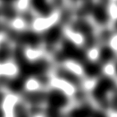
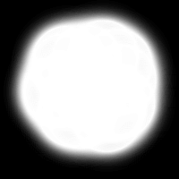

 
 
<h1 align='center'>Description</h1>

 Using starter code from <a href='https://github.com/designcourse/threejs-webpack-starter'>Design Course</a>, this application allows users to control the light source and depth map of any texture the user places in the static folder.

There will be additional features added for other parameters to be edited such as speed for rotation, different texture choices etc.

 
 
<h1 align='center'>Static</h1>

<strong>texture.jpg will be the name used for textures.</strong>

This texture comes with the application.

 

<strong>height.png will be the name for the noise/cloud file.</strong>

This file is what will cause the creases and dips. The darker the point, the deeper the crease will be.

 

<strong>alpha.png will be the name for reducing sharp edges.</strong>

This file is what will cause the light to be more focused in the center reducing visuals of the edges of the plane.

 

<h1 align='center'>Installation</h1>

<strong>Install dependencies</strong> 
npm i 
<strong>Start application on localhost</strong> 
npm run dev 
<strong>Generates build/dist</strong> 
npm run build 

